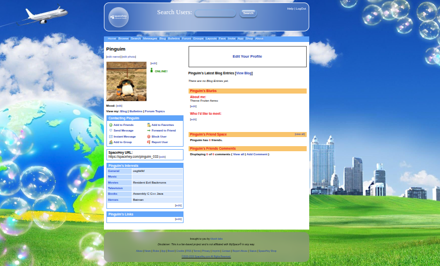

# 🎨 SpaceHey Themes

Uma coleção de temas exclusivos para o **SpaceHey**, todos criados e salvos por aqui.

Cada tema possui sua própria identidade visual, combinando diferentes estéticas, cores e estilos para oferecer uma experiência única ao personalizar ao seu perfil.
 

 

## ✨ O que você encontrará

- 🎭 Temas com diversas estéticas (Y2K, Emo, Scene, Frutiger Aero, Minimalista, entre outras).
- 🎨 Designs originais e personalizados.
- 💻 Códigos prontos para usar.
- 🌟 Atualizações frequentes com novos temas.

# 🎨 De uma olhada em alguns temas disponíveis:

## 🫧 Fruiter Aereo
- Mas, o que é? Frutiger Aero é uma estética de design digital e visual que marcou o período entre 2004 e 2013, combinando esqueumorfismo, texturas brilhantes com efeito de vidro e a harmonia entre tecnologia e natureza. O nome vem da fonte Frutiger e da interface Windows Aero da Microsoft.

### Desing atual (propenso a correções e melhorias):
 
 

Sinta-se à vontade para explorar, usar e se inspirar!
